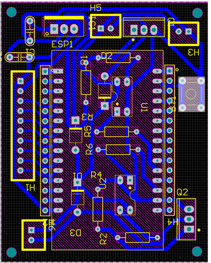

# LINE FOLLOWING ROBOT

An 8-sensor LDR line following robot using ESP32 with dual-threshold hysteresis algorithm. The project includes both Arduino IDE and ESP-IDF development environments, plus threshold calibration tools.

## Table of Contents
- [Project Overview](#project-overview)
- [Directory Structure](#directory-structure)
- [Working Principle](#working-principle)
- [Hardware Components](#hardware-components)
- [Software Architecture](#software-architecture)
- [Build & Flash Instructions](#build--flash-instructions)
- [Threshold Calibration](#threshold-calibration)
- [Hardware Illustrations](#hardware-illustrations)
- [Performance Specifications](#performance-specifications)
- [Video Demonstration](#video-demonstration)

## Project Overview

This line following robot uses 8 LDR (Light Dependent Resistor) sensors arranged in a linear array to detect and follow a black line on a white/light surface. The robot implements a dual-threshold hysteresis algorithm to eliminate sensor noise and achieve stable line tracking performance.

**Key Features:**
- 8 LDR sensors with IR LED illumination
- ESP32 microcontroller with dual ADC units
- Dual-threshold hysteresis for noise reduction
- MOSFET-based motor control with PWM
- Real-time control at 200Hz using FreeRTOS
- Modular software architecture (ESP-IDF components)

## Directory Structure

```

THE_FOLLOWING-LINE_ROBOT/
│
├── ArduinoIDE_module/              \# Arduino IDE reference implementation
│   └── main/
│       └── Algo_Basic.ino          \# Basic algorithm (single threshold)
│
├── Test_board/                     \# Threshold calibration \& testing tools
│   └── Test_LDR_signal_threshold/
│       ├── Find_threshold_value.ino     \# Automatic threshold detection
│       ├── Test_ADC_signal_fr_LDR.ino   \# ADC signal monitoring
│       ├── Test_theshold_value.ino      \# Dual threshold testing
│       ├── Test_morto_with_PWM_signal.c \# Motor PWM testing
│       └── readme.md
│
├── IDF_module/                     \# Main ESP-IDF project
│   ├── components/
│   │   ├── ldr/                    \# LDR sensor driver
│   │   │   ├── ldr.c              \# ADC initialization \& reading
│   │   │   ├── ldr.h              \# LDR definitions \& constants
│   │   │   └── CMakeLists.txt
│   │   └── pwm/                    \# PWM motor driver
│   │       ├── pwm.c              \# LEDC PWM configuration
│   │       ├── pwm.h              \# PWM function declarations
│   │       └── CMakeLists.txt
│   ├── main/
│   │   ├── main.c                 \# Main application with hysteresis
│   │   └── CMakeLists.txt
│   ├── CMakeLists.txt
│   └── dependencies.lock
│
├── Image_product/                  \# Hardware documentation images
│   ├── Control_Motor_PCB_layout.png
│   ├── LDR_Light_Sensor_PCB_layout.png
│   ├── LDR_Light_Sensor_Schematic.png
│   ├── LDR_Sensor_Block_Schematic.png
│   ├── Motor_Control_Block_Schematic.png
│   ├── Power_Block_Schematic.png
│   ├── Schematic.png
│   └── White_LED_Block_Schematic.png
│
└── README.md                       \# This file

```

## Working Principle

### 1. Sensor Array Configuration
- **8 LDR sensors** arranged linearly under the robot chassis
- **IR LED illumination** for consistent lighting conditions
- **Light shields** to reduce ambient light interference
- **Optimal distance**: 1-2cm from surface

### 2. Signal Processing Pipeline
```

Light Reflection → LDR Resistance → Voltage Divider → ADC (12-bit) → Hysteresis Comparison → Digital State (0/1)

```

### 3. Dual-Threshold Hysteresis Algorithm
```

// High threshold: transition from 0 → 1 (line detected)
// Low threshold: transition from 1 → 0 (line lost)
if (!sensorState[i] \&\& adc_val > thresholdHigh[i])
sensorState[i] = true;           // Line detected
else if (sensorState[i] \&\& adc_val < thresholdLow[i])
sensorState[i] = false;          // Line lost

```

### 4. Control Logic
| Sensor Group | Condition | Action |
|--------------|-----------|---------|
| Center (3-4) | At least one active | Go straight / minor correction |
| Left (0-2) | Any active | Turn left (progressive intensity) |
| Right (5-7) | Any active | Turn right (progressive intensity) |
| None | All inactive | Continue last turn direction |

## Hardware Components

### Main Components
- **ESP32 DevKit**: Main microcontroller
- **8x LDR sensors**: GL5539 or similar
- **8x IR LEDs**: 940nm wavelength
- **2x DC geared motors**: 3-9V with gearbox
- **2x MOSFET IRF3205**: Motor control switches
- **Opto-isolators PC817**: PWM signal isolation
- **Li-ion battery pack**: 7.4V (2S configuration)
- **Voltage regulator 7805**: 5V supply for logic

### PCB Modules
1. **LDR Sensor Board**: 8-channel sensor array with IR illumination
2. **Motor Control Board**: MOSFET-based H-bridge with opto-isolation
3. **Power Management**: Battery monitoring and voltage regulation

## Software Architecture

### ESP-IDF Components

#### LDR Component (`components/ldr/`)
- **Function**: ADC initialization and sensor reading
- **ADC Configuration**: 12-bit resolution, 11dB attenuation
- **Pin Mapping**: 
  - ADC1: GPIO 32, 33, 34, 35 (sensors 0-3)
  - ADC2: GPIO 14, 27, 25, 26 (sensors 4-7)

#### PWM Component (`components/pwm/`)
- **Function**: Motor control via LEDC peripheral
- **Configuration**: 8-bit resolution, 5kHz frequency
- **Output Pins**: GPIO 4 (left motor), GPIO 15 (right motor)

#### Main Application (`main/main.c`)
- **Hysteresis threshold arrays**: Pre-calibrated values
- **Control algorithm**: Sensor state processing and motor control
- **FreeRTOS task**: 200Hz control loop (5ms period)

### Key Functions
```

void update_sensor_state(void)     // Read ADC and apply hysteresis
void line_follower(void)           // Main control algorithm
void set_pwm_duty(int, int)        // Set motor speeds

```

## Build & Flash Instructions

### ESP-IDF Environment (Recommended)
```


# Navigate to main project

cd IDF_module

# Set target chip

idf.py set-target esp32

# Configure project (optional)

idf.py menuconfig

# Build project

idf.py build

# Flash and monitor

idf.py flash monitor

```

### Arduino IDE (Reference)
1. Open `ArduinoIDE_module/main/Algo_Basic.ino`
2. Install ESP32 board package
3. Select "ESP32 Dev Module"
4. Upload to board

## Threshold Calibration

### Automatic Calibration Process
1. **Upload calibration firmware**:
```


# Upload Test_board/Test_LDR_signal_threshold/Find_threshold_value.ino

```

2. **Place robot on track**: Position over line and background areas

3. **Read serial output**: Monitor for 1000 samples per sensor
```

LDR     Min     Max     Threshold
LDR 1:  1200    3800    2500
LDR 2:  1150    3750    2450
...

```

4. **Calculate hysteresis values**:
```

thresholdHigh[i] = (min[i] + max[i]) / 2;
thresholdLow[i]  = thresholdHigh[i] - (max[i] - min[i]) * 0.05;  // 5% hysteresis

```

5. **Update main.c** with new threshold arrays

### Manual Testing
Use `Test_theshold_value.ino` to verify threshold performance:
- Real-time sensor state display (0/1)
- Threshold adjustment validation
- Noise immunity testing

## Hardware Illustrations

### System Block Diagram


### Sensor Module
| PCB Layout | Schematic |
|------------|-----------|
|  |  |


### Motor Control Module
| PCB Layout | Schematic |
|------------|-----------|
|  |  |

### Power Supply


## Performance Specifications

### Measured Performance
- **Operating speed**: 0.38 m/s (stable tracking)
- **Minimum turn radius**: 70° corners
- **Optimal line width**: 3cm
- **Battery life**: >3.5 hours continuous operation
- **Control frequency**: 200Hz (5ms period)
- **Response time**: <10ms end-to-end latency

### Environmental Requirements
- **Line contrast**: Black on white/light background
- **Surface**: Flat, non-reflective
- **Lighting**: Indoor LED lighting (stable intensity)
- **Operating voltage**: 6.0V - 8.4V (2S Li-ion range)

## Video Demonstration

### Line Following Performance
[](Image_product/Video_demo_robot.mp4)

> Click thumbnail to watch demo
> This is the lastest demo it different form the thumnail.


### Key Demonstration Points
- **Straight line tracking**: Stable center following
- **Sharp turns**: 70° minimum radius capability  
- **Speed consistency**: Maintains velocity through curves
- **Recovery behavior**: Returns to line after temporary loss

## Technical Notes

### Hysteresis Benefits
- **Noise elimination**: Prevents sensor chattering
- **Stable transitions**: Smooth state changes
- **Ambient light immunity**: Reduces false triggers
- **Consistent performance**: Reliable operation across lighting conditions

### Tuning Parameters
```

\#define MAX_SPEED   100     // Maximum duty cycle (0-255)
\#define BASE_SPEED  20      // Straight-line speed
// Adjust these values based on:
// - Motor specifications
// - Battery voltage
// - Surface friction
// - Desired speed/stability trade-off

```

### Future Enhancements
- **PID control**: Replace discrete speed levels with continuous control
- **Dynamic calibration**: Real-time threshold adjustment
- **Intersection handling**: Navigate T-junctions and crossroads
- **Remote monitoring**: WiFi-based telemetry and control

---

**Project Status**: Completed and tested  
**Last Updated**: June 2025  
**License**: Open source (specify license type)


