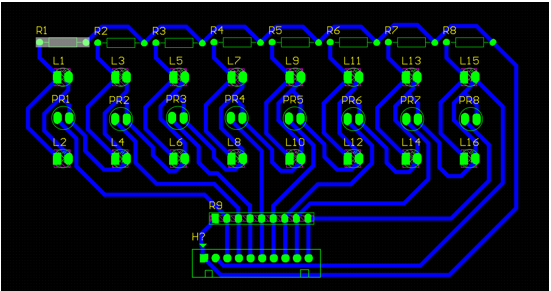

# Line Following Robot

## Project Overview
**Project:** Line Following Robot  
**Framework:** ArduinoIDE  
**Platform:** ESP32  

## Description
- This project uses 8 LDR sensors to detect the line on the ground.
- Cảm biến hồng ngoại are used to detect the line of different colors.
- The robot will follow the line based on the sensor data.
- The robot will stop when all sensors do not detect the line.

## Components

1.  **LDR Sensors (Light Dependent Resistors)**:  
   - Used to detect the line on the ground.  
    **Required Components**:  
    - 470 Ohm Resistors x 8  
    - 5mm White LEDs x 16  
    - Photoresistors x 8  
    - 103 A9*(10K) Resistor Array x 1
   - **Schematic**:   
   - **PCB Layout**: 

2. **White LED**:  
   - Used to illuminate the line on the ground for better detection.  
   - **Schematic**: 

3. **Motors Control**:  
   - Used for movement control.  
   - Controlled through the GPIO pins of ESP32.
    **Required Components**:  
    - DC Motors with Gearbox x2  
    - 1A Schottky Diodes (Any type) x2  
    - N-channel E-MOSFET (preferably with low Ron)  
    - Resistors >10k ohm x2  
    - Resistors 1k ohm x2  
    - Resistors 150 ohm x2  
    - Optocoupler PC817 x2  
    - 2 x 3.7V Batteries connected in series to form a 7.4V Power Supply
   - **Schematic**:   
   - **PCB Layout**: 
    -** **
4. **MCU (ESP32)**: 
     **ESP32-WROOM-30 Pin**
   - The main controller of the robot.  
   - Handles sensor readings and motor controls.  
   - **Schematic**: 

## Connection
- LDR sensors are connected to GPIO pins as defined in the code.
- Motors are connected to GPIO pins as defined in the code.

## Algorithm
- The robot will move straight if both center sensors detect the line.
- The robot will turn left if the left sensors detect the line.
- The robot will turn right if the right sensors detect the line.
- The robot will stop if all sensors do not detect the line.

## How to Calculate the Threshold Value
- The threshold value is the average value of the ADC readings when the sensor detects the line.
- The threshold value is used to compare with the current ADC readings to determine if the sensor detects the line.

## Notes
- The threshold values are set based on the environment and the line color.
- The base speed and the adjustment factor are set based on the robot's performance.
- The robot may need to adjust the threshold values, the base speed, and the adjustment factor to follow the line correctly.

## Version
**Current Version:** 1.0

## Features
- Read ADC values from 8 LDR sensors.
- Detect the line based on the threshold values.
- Control the robot to follow the line.
- Stop the robot when all sensors do not detect the line.

## Upcoming Upgrades
- Add PID control for better line following.
- Add obstacle avoidance feature.
- Add Bluetooth, Wi-Fi control for remote operation.

**Schematics and PCB layout will be updated soon.**
